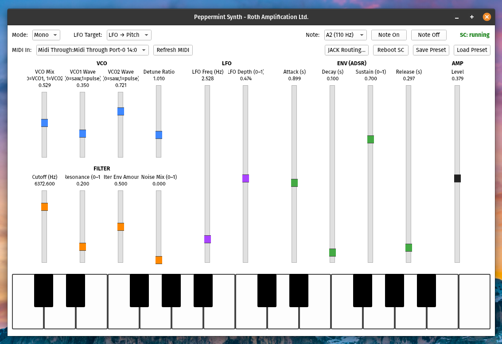

# Peppermint Synth 

------------------------------------------------------------------------

## **Overview**

Peppermint Synth is a **Python + Supriya + SuperCollider--based virtual
analog synthesizer** with:

-   A **PyQt6 graphical interface**
-   A **multithreaded real‑time audio engine**
-   **MIDI input support**
-   **Polyphonic or monophonic** operation
-   A **SuperCollider synth engine** driven through Supriya
-   Real‑time control over oscillator mix, filter, envelopes, LFO
    routing, and more

The entire project is designed to be **modular**, **clean**, and
**extensible**.\
This README explains:

1.  How the project is structured\
2.  How the audio engine works\
3.  How threading and MIDI integrate\
4.  How to install everything\
5.  How to run & use the synth\
6.  Placeholders for screenshots

------------------------------------------------------------------------

## **Project Structure**

    peppermint-synth/
     └── src/
         ├── peppermint_main.py          # Launches GUI + Engine
         ├── peppermint_gui.py           # Full PyQt6 UI
         ├── peppermint_engine.py        # Real-time synth engine (Supriya + SC)
         ├── peppermint_audio_devices.py # JACK / device querying
         ├── peppermint_jack_routing.py  # JACK connections window
         ├── peppermint_midi.py          # MIDI input manager
         ├── peppermint_presets.py       # Preset save/load system
         ├── peppermint_piano.py         # On-screen piano widget
         └── (screenshots go here)

------------------------------------------------------------------------

## **1. How the Synth Engine Works**

The synth engine (in `peppermint_engine.py`) is built around:

### **A. A Supriya SynthDef (`peppermint_voice`)**

A dual‑oscillator subtractive synthesizer:

-   VCO1 & VCO2
    -   each can morph from **saw → pulse**
    -   VCO2 has a **detune ratio**
-   **White noise** mixer
-   **24dB resonant lowpass filter (RLPF)**
-   **ADSR amplitude envelope**
-   **Filter envelope**
-   **LFO routing**
    -   route to pitch\
    -   route to filter cutoff

All UGen parameters use **keyword‑only arguments** (required in modern
Supriya).

The SynthDef is loaded into SuperCollider automatically when the engine
boots.

------------------------------------------------------------------------

### **B. Real‑Time Engine Thread**

The engine uses a **dedicated audio thread** with:

-   A `queue.Queue` that receives commands from the GUI thread\
    (e.g., parameter changes, note on/off, poly/mono switching)
-   A persistent SuperCollider server via Supriya
-   Automatic restart when the user clicks **Reboot SC**
-   Separate internal voice management for:
    -   **Polyphonic mode**
    -   **Monophonic mode**

No GUI operations occur on the audio thread --- preventing audio
dropouts.

------------------------------------------------------------------------

### **C. Voice Handling**

#### **Poly Mode**

-   Each `note_on` creates a **new Synth node**\
-   Stored in `self._poly_voices[midi_note]`
-   `note_off` gates the node to 0\
-   `note_off_all` clears all voices

#### **Mono Mode**

-   One node lives forever\
-   `note_on` updates its frequency + amp\
-   `note_off` releases the envelope\
-   No extra synth nodes are created

------------------------------------------------------------------------

## **2. GUI Architecture (peppermint_gui.py)**

The GUI uses PyQt6 and provides:

-   Real‑time knobs/sliders for all synth parameters
-   **Poly/mono toggle**
-   **JACK routing window**
-   **Preset save / load**
-   **On‑screen MIDI keyboard**
-   **Reboot SC server** button
-   **Status indicators** (SC running, MIDI active)

All interactions send commands to the engine thread via message queue.

------------------------------------------------------------------------

## **3. MIDI Input (peppermint_midi.py)**

-   Uses `mido` or `python-rtmidi` depending on platform
-   Runs its own **background MIDI thread**
-   Converts incoming MIDI messages into:
    -   `note_on`
    -   `note_off`
    -   CC messages (mapped to parameters in future updates)
-   Safe handoff to synth engine via command queue

------------------------------------------------------------------------

## **4. JACK Routing (peppermint_jack_routing.py)**

-   Optional routing window using `jack-client` or shell commands
-   Enumerates JACK ports
-   Lets user click‑to‑connect:
    -   SC outputs → system outputs
    -   MIDI routing

------------------------------------------------------------------------

## **5. Installation Instructions**

### **A. System Requirements**

-   Linux (recommended)
-   Python **3.10+**
-   SuperCollider installed (`scsynth` must be runnable)
-   JACK installed (optional but recommended)
-   MIDI hardware or virtual MIDI

------------------------------------------------------------------------

### **B. Install Dependencies**

#### **1. System Packages**

``` bash
sudo apt install python3-pip python3-pyqt6 supercollider jackd2 qjackctl
```

#### **2. Python Dependencies**

Inside `peppermint-synth/src/`:

``` bash
pip install supriya mido python-rtmidi PyQt6
```

If using a virtualenv:

``` bash
python3 -m venv venv
source venv/bin/activate
pip install supriya mido python-rtmidi PyQt6
```

------------------------------------------------------------------------

### **6. Running the Program**

Inside `src/`:

``` bash
python peppermint_main.py
```

You will see:

    [MIDI] Opened input port...
    [MIDI] MIDI thread started.

If SC boots correctly:

    [Peppermint] Server booted

If SC fails (port in use), click **Reboot SC**.

------------------------------------------------------------------------

## **7. Using the Synthesizer**

### **Oscillators**

-   Adjust `VCO1 wave` and `VCO2 wave` (saw ↔ pulse)
-   Set detune amount
-   Choose mono or poly mode

### **Filter**

-   Adjust cutoff in real time\
-   Resonance control\
-   Envelope amount\
-   LFO → Filter modulation

### **LFO**

-   Set frequency\
-   Depth\
-   Choose routing mode\
    (pitch-only, filter-only, or crossfade mix)

### **Amplitude / Envelope**

-   ADSR parameters\
-   Velocity sensitivity\
-   Global Amp parameter

------------------------------------------------------------------------

## **8. Presets**

-   Save preset\
-   Load preset\
-   JSON‑based preset format\
-   Future-compatible for added parameters

------------------------------------------------------------------------

## **9. Threading Model**

    [ GUI Thread ] → sends commands → [ Engine Thread ] → controls → SC server
    [ MIDI Thread ] → sends events ----^

Every potentially blocking operation is isolated from the audio path.

------------------------------------------------------------------------

## **10. Troubleshooting**

### **SC Server won't boot**

Port conflict --- something else is running `scsynth`.\
Use:

``` bash
ps aux | grep scsynth
```

Kill it or reboot SC via GUI.

------------------------------------------------------------------------

### **Node not found warnings**

Already fixed in latest engine (no auto‑free).\
If they appear again, reboot SC.

------------------------------------------------------------------------

### **No audio**

Check JACK connections\
or use system default ALSA device.

------------------------------------------------------------------------

## **11. Screenshots**





------------------------------------------------------------------------

## **12. Future Features**

-   Effects (chorus, delay, reverb)
-   Unison detune spread
-   More waveform types
-   CPU profiling view
-   Mod matrix
-   External CV/MIDI automation
-   OSC remote control

------------------------------------------------------------------------

## **13. License**

GPL V3

Enjoy your synth. More features coming soon!\

